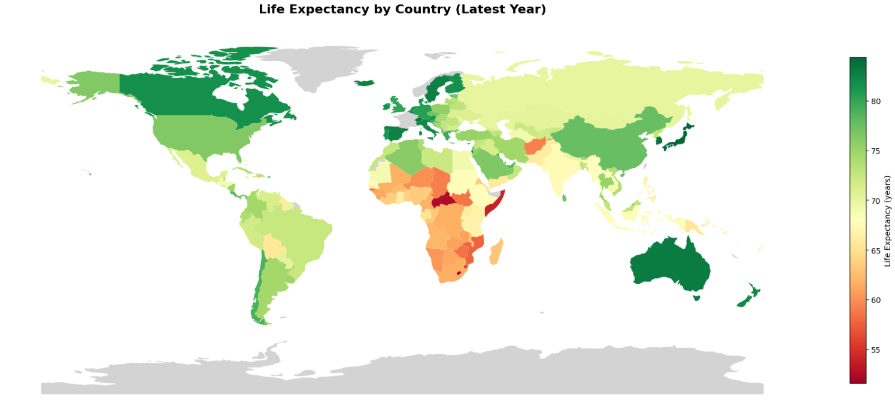
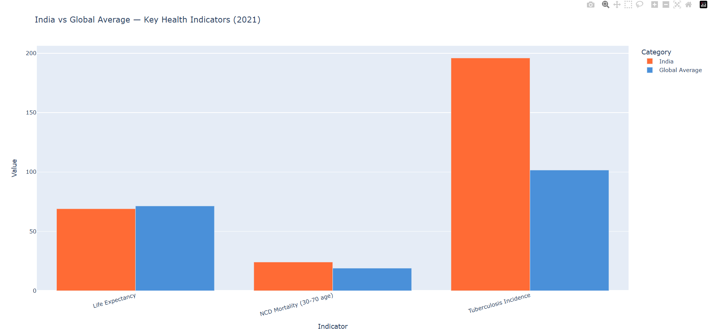
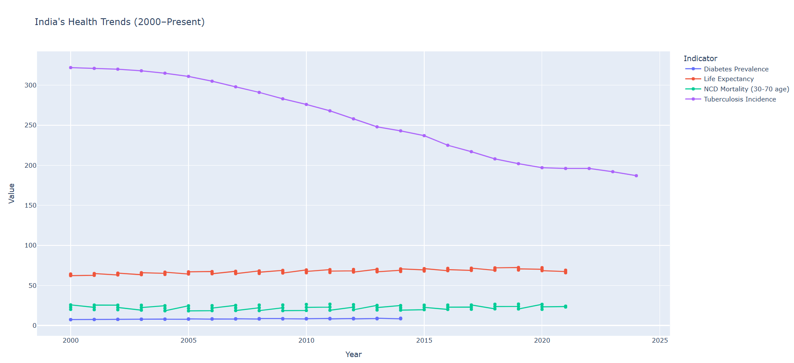
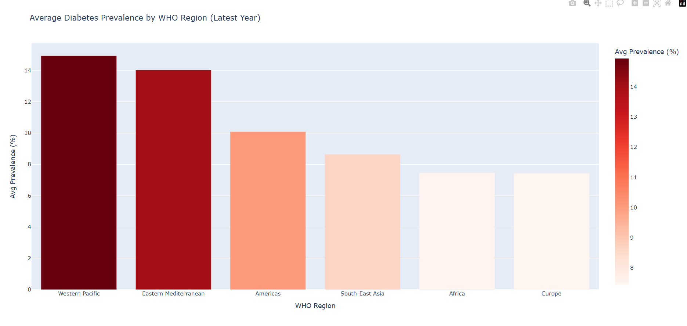

# 🌍 WHO Global Disease Surveillance

Analysing global health indicators across 203 countries using the WHO Global Health Observatory (GHO) API, SQL, and Python.

## 📌 Project Overview
This project fetches live data from the WHO API, stores it in a SQLite database, queries it using SQL, and visualises key health insights through interactive charts and a world map.

## ❓ Business Questions Answered
- Which countries have the highest and lowest life expectancy?
- How does India compare to the global average across key health indicators?
- Which WHO regions have the highest diabetes prevalence?
- How has India's TB incidence changed over the last 20 years?
- Which countries have the worst tuberculosis burden?

## 🔍 Key Findings
- India's TB incidence (196/100k) is nearly **double** the global average (101/100k)
- India's life expectancy (69 years) is **2.3 years below** the global average
- **Western Pacific** has the highest diabetes prevalence globally (14.9%)
- Life expectancy gap between best (Singapore 86.3) and worst (Lesotho 48.7) is **37 years**
- India's TB incidence has dropped from 320 (2000) to 196 (2021) — a 39% improvement

## 🛠️ Tech Stack
| Tool | Purpose |
|---|---|
| Python | Core programming |
| WHO GHO API | Live data source |
| SQLite + SQL | Data storage and querying |
| Pandas | Data cleaning and analysis |
| Matplotlib | Static visualisations |
| GeoPandas | World map choropleth |
| Plotly | Interactive charts |
| Looker Studio | BI Dashboard |

## 📊 SQL Concepts Used
- GROUP BY, ORDER BY, HAVING
- Subqueries
- CASE WHEN
- Window functions (RANK)
- Joins across tables
- CTEs

## 📁 Project Structure
who-global-disease-surveillance/
├── who_global_disease_surveillance.ipynb  # Main notebook
├── who_dashboard.py                       # Streamlit app
├── who_health_data.csv                    # Cleaned dataset
├── who_health.db                          # SQLite database
├── world_map.png                          # Life expectancy world map
├── india_vs_global.png                    # India vs global comparison
├── india_trend.png                        # India health trends
└── diabetes_region.png                    # Diabetes by WHO region

## 📈 Visualisations
### Life Expectancy World Map


### India vs Global Average


### India Health Trends (2000–Present)


### Diabetes Prevalence by WHO Region


## 🚀 How to Run
```bash
# Clone the repo
git clone https://github.com/YOUR_USERNAME/who-global-disease-surveillance

# Install dependencies
pip install pandas matplotlib geopandas plotly streamlit requests sqlite3 pycountry

# Run the Streamlit dashboard
streamlit run who_dashboard.py
```

## 📡 Data Source
[WHO Global Health Observatory (GHO) API](https://www.who.int/data/gho/info/gho-odata-api)
- Free, no authentication required
- 200+ countries, 1000+ health indicators
- Updated regularly by WHO

## 👩‍💻 Author
**Siya Tambe**  
Second Year Engineering Student | Aspiring Data Analyst  
[LinkedIn](#) | [GitHub](#https://github.com/Siya-Tambe/WHO-global-disease-surveillance)
"""
